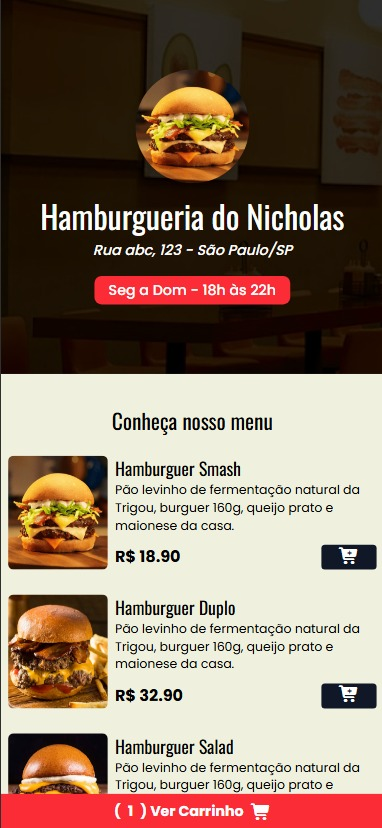

# Hamburgueria do Nicholas 🍔

Projeto de cardápio online para hamburgueria, desenvolvido com **HTML**, **TailwindCSS** e **JavaScript**.

O sistema permite visualizar os produtos, adicionar itens ao carrinho, remover itens, validar endereço, checar horário de funcionamento e enviar o pedido diretamente para o **WhatsApp**.

## ✨ Funcionalidades

- Listagem de lanches e bebidas
- Adição e remoção de itens no carrinho
- Contador com quantidade real de produtos
- Cálculo automático do valor total
- Modal de carrinho responsivo
- Validação de endereço
- Verificação de horário de funcionamento
- Feedback visual com **Toastify**
- Animações ao adicionar itens
- Envio do pedido formatado para o WhatsApp

## 🚀 Tecnologias utilizadas

- HTML5
- TailwindCSS
- JavaScript
- Toastify

## 📱 Responsividade

O projeto foi desenvolvido com foco em responsividade, incluindo ajustes para melhor funcionamento em dispositivos móveis.

## 📌 Aprendizados

Esse projeto foi muito importante para praticar conceitos de front-end, como:

- Manipulação do DOM
- Eventos com JavaScript
- Atualização dinâmica de interface
- Validações de formulário
- Estado do carrinho
- Experiência do usuário (UX)

## 🎓 Referência

Projeto desenvolvido com base em uma aula do **Matheus Fraga (Sujeito Programador)**, com diversas adaptações e melhorias feitas por mim, principalmente em estrutura, feedback visual e experiência do usuário.

## 🔧 Melhorias implementadas por mim

Algumas melhorias adicionadas em relação à base estudada:

- maior uso toasts para feedback visual
- animações nos botões
- mensagem do WhatsApp mais organizada
- ajustes no fluxo de checkout
- melhorias de usabilidade no modal do carrinho
- refinamentos na estrutura do projeto

## 📷 Preview

